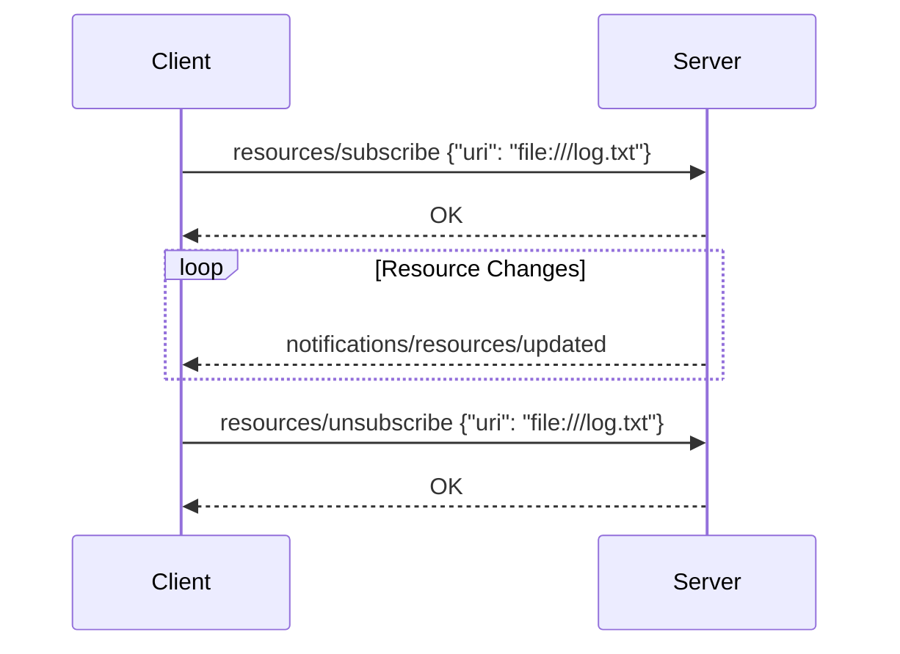

# Lesson 4.2: Subscriptions & Real-Time Updates

## 🎯 Learning Objectives
By the end of this lesson, you will:
- Understand MCP's subscription mechanism
- Implement resource change notifications
- Build real-time update systems
- Handle subscription lifecycle

---

## 📋 What Are Subscriptions?

**Subscriptions** allow clients to receive updates when resources change:

```
┌──────────┐              ┌──────────┐
│  Client  │ ◀── Update ─ │  Server  │
│          │ ── Watch ─▶  │          │
└──────────┘              └──────────┘
```

**Use Cases:**
- Live logs
- File watching
- Database changes
- System metrics
- Chat messages

---

## 🔄 Subscription Flow



---

## 💻 Implementing Subscriptions

### Server with File Watching

```typescript
import { Server } from "@modelcontextprotocol/sdk/server/index.js";
import { StdioServerTransport } from "@modelcontextprotocol/sdk/server/stdio.js";
import * as fs from "fs";
import * as path from "path";

const BASE_DIR = "/home/user/project";
const watchers: Map<string, fs.FSWatcher> = new Map();
const subscribers: Map<string, Set<string>> = new Map(); // uri -> connection IDs

const server = new Server(
  { name: "subscription-server", version: "1.0.0" },
  { 
    capabilities: { 
      resources: {
        subscribe: true,
        listChanged: true
      }
    } 
  }
);

// Subscribe to resource changes
server.setRequestHandler(SubscribeRequestSchema, async (request) => {
  const { uri } = request.params;
  const url = new URL(uri);
  
  if (url.protocol !== "file:") {
    throw new Error("Only file:// resources support subscriptions");
  }
  
  const filePath = path.join(BASE_DIR, url.pathname);
  
  // Set up watcher if not already watching
  if (!watchers.has(filePath)) {
    const watcher = fs.watch(filePath, async (eventType) => {
      console.error(`File ${filePath} changed: ${eventType}`);
      
      // Notify subscribers
      await notifySubscribers(uri, eventType);
    });
    
    watchers.set(filePath, watcher);
    subscribers.set(uri, new Set());
  }
  
  // Add this connection to subscribers
  // Note: In real implementation, track connection ID
  subscribers.get(uri)?.add("current-connection");
  
  console.error(`Subscribed to: ${uri}`);
  return {};
});

// Unsubscribe
server.setRequestHandler(UnsubscribeRequestSchema, async (request) => {
  const { uri } = request.params;
  const url = new URL(uri);
  const filePath = path.join(BASE_DIR, url.pathname);
  
  // Remove subscriber
  const subs = subscribers.get(uri);
  subs?.delete("current-connection");
  
  // Clean up watcher if no more subscribers
  if (subs?.size === 0) {
    watchers.get(filePath)?.close();
    watchers.delete(filePath);
    subscribers.delete(uri);
    console.error(`Cleaned up watcher for: ${uri}`);
  }
  
  return {};
});

// Notify subscribers of changes
async function notifySubscribers(uri: string, eventType: string) {
  await server.notification({
    method: "notifications/resources/updated",
    params: { uri }
  });
}

// Handle graceful shutdown
process.on("SIGINT", () => {
  console.error("Closing watchers...");
  for (const [, watcher] of watchers) {
    watcher.close();
  }
  process.exit(0);
});

const transport = new StdioServerTransport();
server.connect(transport);
```

---

## 🔌 Client-Side Subscriptions

```typescript
// Client subscribing to updates
await client.subscribeResource("file:///log.txt");

// Listen for notifications
client.onNotification("notifications/resources/updated", (params) => {
  console.log(`Resource updated: ${params.uri}`);
  // Fetch latest content
  const resource = await client.readResource(params.uri);
});

// Unsubscribe when done
await client.unsubscribeResource("file:///log.txt");
```

---

## 📊 Notification Types

| Notification | When Sent | Payload |
|--------------|-----------|---------|
| `resources/updated` | Resource content changed | `{ uri }` |
| `resources/list_changed` | Available resources changed | None |
| `tools/list_changed` | Available tools changed | None |
| `prompts/list_changed` | Available prompts changed | None |

---

## 🧪 Testing Subscriptions

```bash
# Terminal 1: Start server
node subscription-server.js

# Terminal 2: Test with inspector
npx @modelcontextprotocol/inspector node subscription-server.js

# Terminal 3: Modify watched file
echo "New log entry" >> /home/user/project/log.txt
```

---

## 💡 Advanced: Polling Fallback

Not all resources support native watching. Use polling:

```typescript
class PollingResourceWatcher {
  private intervals: Map<string, NodeJS.Timeout> = new Map();
  private lastHash: Map<string, string> = new Map();
  
  startWatching(uri: string, intervalMs: number = 5000) {
    const interval = setInterval(async () => {
      const content = await this.fetchResource(uri);
      const hash = this.hash(content);
      
      if (hash !== this.lastHash.get(uri)) {
        this.lastHash.set(uri, hash);
        await this.notify(uri);
      }
    }, intervalMs);
    
    this.intervals.set(uri, interval);
  }
  
  stopWatching(uri: string) {
    const interval = this.intervals.get(uri);
    if (interval) {
      clearInterval(interval);
      this.intervals.delete(uri);
    }
  }
  
  private hash(content: string): string {
    // Simple hash implementation
    return require("crypto").createHash("md5").update(content).digest("hex");
  }
  
  // ...
}
```

---

## 🌊 Real-Time Data Patterns

### 1. Log Streaming Server

```typescript
// Stream application logs
server.setRequestHandler(SubscribeRequestSchema, async (request) => {
  const { uri } = request.params;
  
  if (uri === "logs:///stream") {
    // Tail log file
    const child = spawn("tail", ["-f", "/var/log/app.log"]);
    
    child.stdout.on("data", async (data) => {
      await server.notification({
        method: "notifications/resources/updated",
        params: { uri }
      });
    });
  }
});
```

### 2. Database Change Feed

```typescript
// Using PostgreSQL LISTEN/NOTIFY
const dbClient = new pg.Client();
await dbClient.connect();

await dbClient.query("LISTEN table_changes");

dbClient.on("notification", async (msg) => {
  await server.notification({
    method: "notifications/resources/updated",
    params: { uri: `db:///table/${msg.payload}` }
  });
});
```

---

## 📚 Summary

| Aspect | Details |
|--------|---------|
| **Capability** | `{ resources: { subscribe: true } }` |
| **Subscribe** | `resources/subscribe` with URI |
| **Unsubscribe** | `resources/unsubscribe` with URI |
| **Notification** | `notifications/resources/updated` |
| **Mechanisms** | File watchers, polling, database triggers |
| **Cleanup** | Always unsubscribe and close watchers |

---

## ✅ Practice Exercise

Complete [Exercise 4.2: Real-Time Log Watcher](../exercises/exercise-04-2-log-watcher.md)
